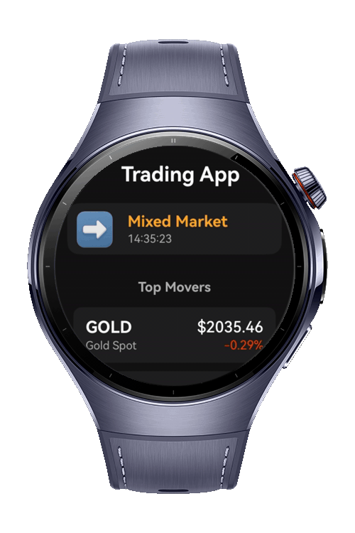
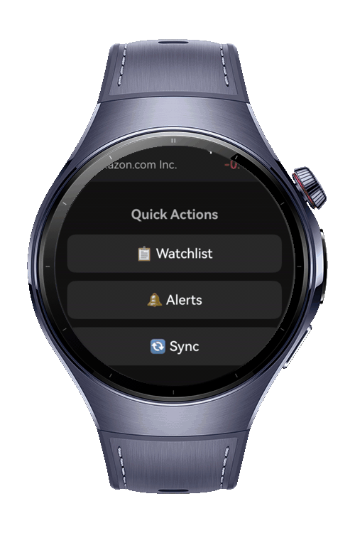

> **Note:** To access all shared projects, get information about environment setup, and view other guides, please visit [Explore-In-HMOS-Wearable Index](https://github.com/Explore-In-HMOS-Wearable/hmos-index).

# Trading Wearable App

A professional wearable market quotes app showcasing real-time data updates, watchlist management, and price alerts on HarmonyOS smartwatches. Built with wearable-first design principles and Navigation component pattern.
This app demonstrates how to deliver a smooth, battery-friendly financial data experience on watch-class devices. It's intentionally kept modular so you can lift individual patterns—like real-time subscriptions, persistent storage, or modal sheets—into your own projects.

**Key Features:**
- Real-time market quotes with 2-second updates
- Personal watchlist with instant sync
- Price alerts with trigger notifications
- Mock cross-device sync flow
- Navigation component architecture

# Preview

<div>
  
  
  
  
</div>

# Use Cases

## Market Overview

A glanceable dashboard showing market sentiment (UP/DOWN/MIXED), top 3 movers, and watchlist preview. Users get instant insights without scrolling, with quick access to detailed views and sync actions.

## Watchlist Management

Personalized symbol tracking with search, add/remove actions, and persistence. Users can manage their portfolio from their wrist, with data automatically saved and synced across sessions.

## Symbol Detail

Deep-dive view with price history sparkline, high/low stats, and quick alert creation. Large touch targets and clear typography make it easy to monitor specific assets and set up notifications.

## Price Alerts

Condition-based alerts (ABOVE/BELOW) with in-app notifications and trigger history. Users stay informed of market movements without constantly checking prices, with smart cooldowns preventing spam.

# Tech Stack

* **Languages:** ArkTS, ArkUI
* **Framework:** HarmonyOS NEXT SDK 6.0
* **Architecture:** Navigation component + Services + Stores pattern
* **Persistence:** @ohos.data.preferences

# Constraints and Restrictions

## Supported Device

* Huawei Watch 5

# Directory Structure

```
entry/src/main/ets/
├── model/
│   ├── Asset.ets              # Asset data model with price history
│   ├── PriceAlert.ets         # Price alert model with trigger logic
│   ├── Types.ets              # Type definitions (AlertCondition, SyncState, etc.)
│   └── Formatters.ets         # Utility functions for price/time formatting
│
├── services/
│   ├── QuoteService.ets       # Mock quote engine with 2s tick updates
│   ├── AlertEngine.ets        # Alert monitoring and trigger notifications
│   └── MockSyncService.ets    # Simulated cross-device sync workflow
│
├── store/
│   ├── WatchlistStore.ets     # Watchlist management with persistence
│   ├── AlertStore.ets         # Alert storage with CRUD operations
│   ├── SettingsStore.ets      # App settings (refresh interval, haptic)
│   └── StoreProvider.ets      # Store initialization helper
│
├── utils/
│   └── NavigationService.ets  # Global navigation state management
│
├── components/
│   ├── QuoteRow.ets           # Reusable quote display component
│   ├── SectionHeader.ets      # Section title with optional action
│   ├── InAppBanner.ets        # Toast-style notification banner
│   ├── Sparkline.ets          # Lightweight price history chart
│   ├── AddSymbolSheet.ets     # Bottom sheet for adding symbols
│   ├── EditAlertSheet.ets     # Bottom sheet for creating/editing alerts
│   └── SyncStatusSheet.ets    # Bottom sheet for sync progress
│
├── pages/
│   ├── Index.ets              # NavigationRouter entry point
│   ├── HomePage.ets           # Market overview with sentiment and movers
│   ├── WatchlistPage.ets      # User watchlist with add/remove actions
│   ├── SymbolDetailPage.ets   # Symbol detail with sparkline and alerts
│   └── AlertsPage.ets         # Alert management with trigger history
│
└── resources/
    └── base/profile/
        └── main_pages.json    # Page registration config
```

# LICENSE

**Trading Wearable App** is distributed under the terms of the MIT License.
See the [LICENSE](/LICENSE) for more information.

